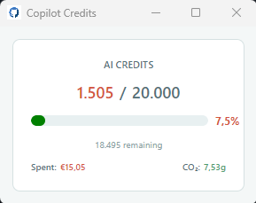

# Copilot Credits



A lightweight cross-platform desktop application that displays your used GitHub Copilot AI credits, automatically refreshing from your GitHub Copilot settings.

## ✅ Platform Support

**Supported on Windows, macOS, and Linux**
- Built with .NET 10.0 and Avalonia (cross-platform GUI framework)
- Runs on any OS with .NET 10.0 runtime installed

## Prerequisites

- **[.NET 10.0 SDK](https://dotnet.microsoft.com/en-us/download)** - Required to build and run the app (Windows, macOS, Linux)
- **GitHub account** - With Copilot subscription
- **Internet connection on first run** (the app downloads its Playwright Chromium browser automatically)

## Setup (First Time Only)

1. **Clone/download the repository** and navigate to the project directory

2. **Run the app:**
   ```bash
   dotnet run
   ```
   
   The app automatically downloads and installs the Playwright Chromium browser on first run (approximately 300MB).

## Linux Setup

The app's UI renders natively (via Avalonia), but the underlying data is scraped from GitHub using Playwright + headless Chromium. On Linux, these browsers and their system dependencies are **not** installed by default, so you'll need to install them manually:

1. **Install the Playwright CLI:**
   ```bash
   dotnet tool install --global Microsoft.Playwright.CLI
   ```

2. **Add the .NET tools directory to your PATH** (so the `playwright` command works):
   ```bash
   export PATH="$PATH:$HOME/.dotnet/tools"
   ```
   To make this permanent, add the line above to your `~/.bashrc` (or `~/.zshrc`).

3. **Install the Chromium browser** (the app does this automatically on first run, but you can install it explicitly):
   ```bash
   playwright install chromium
   ```

4. **Install the Linux system dependencies** that Chromium needs (shared libraries, fonts, X11 helpers):
   ```bash
   playwright install-deps chromium
   ```
   This uses `sudo` to install the required packages. If you'd prefer to install only the OS packages (without Playwright's own browser downloads), use:
   ```bash
   playwright install-deps --only-shell chromium   # or `--dry-run` to preview the commands
   ```

5. **Run the app:**
   ```bash
   dotnet run --project .\CopilotCredits.csproj
   ```

> **Note:** On first launch the app downloads Chromium if needed and may open a visible browser window so you can sign in to GitHub once. After that it runs headlessly using the cached session. If it displays `--`, check the error message in the app and the terminal output for browser or sign-in details.

## Run

```bash
dotnet run --project .\CopilotCredits.csproj
```

Or if you have the app built:
```bash
./bin/Debug/net10.0/CopilotCredits
```

The app will:
- Display your used AI credits in a small window
- Automatically refresh every 1 minute
- Run Chromium **headlessly** (no browser window) if your GitHub session is cached
- Open a browser if GitHub sign-in is required

## Browser Profile

Your GitHub browser session is stored locally at:

**Windows:** `%LOCALAPPDATA%\CopilotCredits\browser-profile`  
**macOS:** `~/.local/share/CopilotCredits/browser-profile`  
**Linux:** `~/.local/share/CopilotCredits/browser-profile`

## Troubleshooting

| Issue | Solution |
|-------|----------|
| "Chromium not found" error | Run `dotnet run` with an internet connection. The app installs Chromium automatically; ensure you have ~300MB disk space |
| App shows `--` for credits on Linux | Chromium is missing. Install it: `dotnet tool install --global Microsoft.Playwright.CLI`, then `playwright install chromium` and `playwright install-deps chromium` (see [Linux Setup](#linux-setup)) |
| Browser window opens repeatedly | Sign in to GitHub when prompted. Your session will be cached for future runs |
| Credits won't load | Ensure your GitHub Copilot subscription is active and you're signed into GitHub |
| App won't start on macOS | Ensure .NET 10.0 is installed: `dotnet --version` |

## Development

Built with:
- **.NET 10.0** - Cross-platform runtime
- **[Avalonia](https://avaloniaui.net/)** - Cross-platform desktop UI framework
- **[Playwright](https://playwright.dev/)** - Browser automation for scraping credits